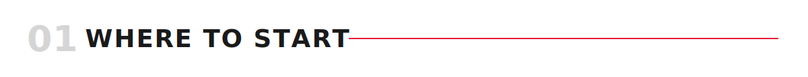
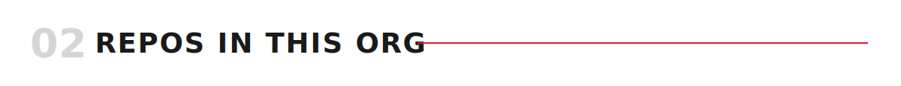

<picture><source media="(prefers-color-scheme: dark)" srcset="assets/dark/header.svg"/></picture>

<a href="#repos-in-this-org"><picture><source media="(prefers-color-scheme: dark)" srcset="https://img.shields.io/badge/REPOS-0d1117?style=flat-square&logoColor=ffffff"/></picture></a>
<a href="https://github.com/JQInanophotonics/QuickStartGit"><picture><source media="(prefers-color-scheme: dark)" srcset="https://img.shields.io/badge/QUICKSTART%20GIT-0d1117?style=flat-square&logoColor=ffffff"/></picture></a>
<a href="https://github.com/JQInanophotonics/ScientificGraphicDesign"><picture><source media="(prefers-color-scheme: dark)" srcset="https://img.shields.io/badge/GRAPHIC%20DESIGN-0d1117?style=flat-square&logoColor=ffffff"/></picture></a>

<picture><source media="(prefers-color-scheme: dark)" srcset="assets/dark/banner-forewords.svg"/></picture>

Practical, no-nonsense guides for the day-to-day skills of doing and publishing research in the group. Mostly markdown notes and example files — think "poor-boy wiki," not formal documentation. Pull what's useful, ignore the rest.

Part of the [Srinivasan Group](https://srinivasan.jqi.umd.edu) at JQI. Maintained mostly by Grégory Moille.

<picture><source media="(prefers-color-scheme: dark)" srcset="assets/dark/banner-where-to-start.svg"/></picture>

New to the group? Start with the two prerequisite repos if either tool is new to you — [QuickStartGit](https://github.com/JQInanophotonics/QuickStartGit) if you've never used Git, [LaTeX-QuickHowTo](https://github.com/JQInanophotonics/LaTeX-QuickHowTo) if you've never compiled a LaTeX document. From there, read [ScientificGraphicDesign](https://github.com/JQInanophotonics/ScientificGraphicDesign) first among the core wikis — it covers the tools (Illustrator, Blender, plotting) you'll use across almost every project. Then check [ScientificDataManagement](https://github.com/JQInanophotonics/ScientificDataManagement) before you start collecting data on a new project, so you set things up right from day one.

<picture><source media="(prefers-color-scheme: dark)" srcset="assets/dark/banner-repos.svg"/></picture>

**Prerequisites** — read these first if the tool itself is new to you:

| Repo | What it covers |
|---|---|
| 🔧 [**QuickStartGit**](https://github.com/JQInanophotonics/QuickStartGit) | Git from zero: cloning, committing, branching, pull requests, Overleaf sync |
| 📄 [**LaTeX-QuickHowTo**](https://github.com/JQInanophotonics/LaTeX-QuickHowTo) | Installing a LaTeX distribution, compiling, citations, editor setup |

**Core wikis** — the day-to-day practical guides:

| Repo | What it covers |
|---|---|
| 🎨 [**ScientificGraphicDesign**](https://github.com/JQInanophotonics/ScientificGraphicDesign) | Plotting conventions, making figures publication-ready, Illustrator styles, Blender boilerplates, fonts |
| 🎤 [**ScientificPresentations**](https://github.com/JQInanophotonics/ScientificPresentations) | Slide decks, Beamer, and general talk/presentation design |
| 🗃️ [**ScientificDataManagement**](https://github.com/JQInanophotonics/ScientificDataManagement) | Rules for collecting and organizing data, folder/naming conventions, and how to compile & archive data for published papers *(in progress)* |
| ✍️ [**ScientificWriting**](https://github.com/JQInanophotonics/ScientificWriting) | How to write a scientific paper, structure, and handling bibliography/citations *(not started yet)* |

**Tools & templates** — code and starting points, not wikis:

| Repo | What it covers |
|---|---|
| 🖥️ [**JqiNanoBeamerTemplate**](https://github.com/JQInanophotonics/JqiNanoBeamerTemplate) | The group's Beamer template and house style for talks — clone fresh per talk |
| 🐍 [**pyprettyplot**](https://github.com/JQInanophotonics/pyprettyplot) | Python package that pre-loads the group's plotting style for matplotlib/plotly |

**Lab-specific:**

| Repo | What it covers |
|---|---|
| 🔬 [**InstrumentControl**](https://github.com/JQInanophotonics/InstrumentControl) | Lab equipment operation |
| 🖨️ [**3DPrintedLabParts**](https://github.com/JQInanophotonics/3DPrintedLabParts) | Shared designs for 3D-printed lab parts |

<picture><source media="(prefers-color-scheme: dark)" srcset="assets/dark/banner-contributing.svg"/></picture>

Found something missing or wrong? Open an issue or PR on the relevant repo, these guides are meant to grow as the group learns.
